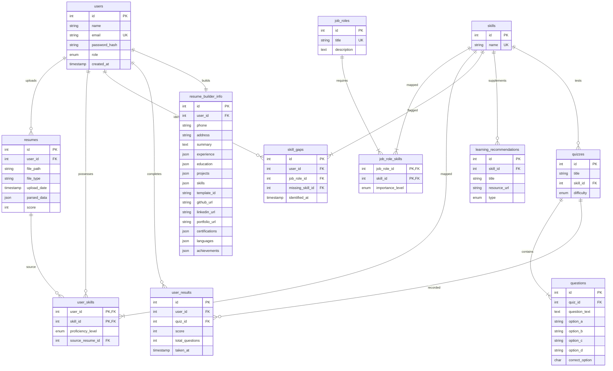

# 🗄️ Relational Database Schema & Data Models - SkillLens Pro

SkillLens Pro utilizes a relational **MySQL** database (`skilllens_db`) to store, index, and query user credentials, parsed resume assets, mock interview modules, and metrics.

---

## 📊 Entity Relationship Diagram (ERD)

This diagram visualizes the relational connections, many-to-many associations, and cascading structures:



---

## 🗂️ Detailed Table Catalog

### 1. `users`
Stores user identities, login passwords, and roles.
* **Indexes:** `PRIMARY KEY` on `id`, `UNIQUE` index on `email`.
* **Columns:**
  - `id`: `INT AUTO_INCREMENT`
  - `name`: `VARCHAR(100)`
  - `email`: `VARCHAR(100)` (Unique)
  - `password_hash`: `VARCHAR(255)`
  - `role`: `ENUM('student', 'admin')` (Default: `'student'`)
  - `created_at`: `TIMESTAMP` (Default: `CURRENT_TIMESTAMP`)

### 2. `resumes`
Holds metadata and extracted output of parsed resumes.
* **Relations:** `user_id` links to `users.id` with `ON DELETE CASCADE`.
* **Special Column `parsed_data` (JSON):** Stores extracted technical text tokens or NLP outputs.
* **Columns:**
  - `id`: `INT AUTO_INCREMENT`
  - `user_id`: `INT` (Foreign Key)
  - `file_path`: `VARCHAR(255)`
  - `file_type`: `VARCHAR(255)`
  - `upload_date`: `TIMESTAMP` (Default: `CURRENT_TIMESTAMP`)
  - `parsed_data`: `JSON`
  - `score`: `INT` (Default: `0`)

### 3. `job_roles`
Master registry of career target profiles.
* **Indexes:** `PRIMARY KEY` on `id`, `UNIQUE` index on `title`.
* **Columns:**
  - `id`: `INT AUTO_INCREMENT`
  - `title`: `VARCHAR(100)`
  - `description`: `TEXT`

### 4. `skills`
Master catalog of parsed technologies and technical competencies.
* **Indexes:** `PRIMARY KEY` on `id`, `UNIQUE` index on `name`.
* **Columns:**
  - `id`: `INT AUTO_INCREMENT`
  - `name`: `VARCHAR(100)`

### 5. `job_role_skills`
Many-to-many join table mapping requirements to target jobs.
* **Indexes:** Composite `PRIMARY KEY` on `(job_role_id, skill_id)`.
* **Relations:**
  - `job_role_id` links to `job_roles.id` `ON DELETE CASCADE`.
  - `skill_id` links to `skills.id` `ON DELETE CASCADE`.
* **Columns:**
  - `job_role_id`: `INT`
  - `skill_id`: `INT`
  - `importance_level`: `ENUM('low', 'medium', 'high')` (Default: `'medium'`)

### 6. `user_skills`
Extracted skills assigned to a user profile, tied to a resume source.
* **Indexes:** Composite `PRIMARY KEY` on `(user_id, skill_id)`.
* **Relations:**
  - `user_id` links to `users.id` `ON DELETE CASCADE`.
  - `skill_id` links to `skills.id` `ON DELETE CASCADE`.
  - `source_resume_id` links to `resumes.id` `ON DELETE SET NULL` (preserves profile skills if a historical resume is deleted).
* **Columns:**
  - `user_id`: `INT`
  - `skill_id`: `INT`
  - `proficiency_level`: `ENUM('beginner', 'intermediate', 'advanced')`
  - `source_resume_id`: `INT`

### 7. `skill_gaps`
Stores computed skill deficiency results for students matching a target role.
* **Relations:** `user_id`, `job_role_id`, and `missing_skill_id` all cascade deletes.
* **Columns:**
  - `id`: `INT AUTO_INCREMENT`
  - `user_id`: `INT`
  - `job_role_id`: `INT`
  - `missing_skill_id`: `INT`
  - `identified_at`: `TIMESTAMP` (Default: `CURRENT_TIMESTAMP`)

### 8. `learning_recommendations`
Resources mapped to skills for bridging detected gaps.
* **Relations:** `skill_id` foreign key cascades on delete.
* **Columns:**
  - `id`: `INT AUTO_INCREMENT`
  - `skill_id`: `INT`
  - `title`: `VARCHAR(255)`
  - `resource_url`: `VARCHAR(255)`
  - `type`: `ENUM('course', 'article', 'video', 'practice')`

### 9. `quizzes`
Tests corresponding to a particular skill.
* **Relations:** `skill_id` cascades on delete.
* **Columns:**
  - `id`: `INT AUTO_INCREMENT`
  - `title`: `VARCHAR(255)`
  - `skill_id`: `INT`
  - `difficulty`: `ENUM('easy', 'medium', 'hard')`

### 10. `questions`
Individual multiple-choice options tied to a parent quiz.
* **Relations:** `quiz_id` foreign key cascades on delete.
* **Columns:**
  - `id`: `INT AUTO_INCREMENT`
  - `quiz_id`: `INT`
  - `question_text`: `TEXT`
  - `option_a`: `VARCHAR(255)`
  - `option_b`: `VARCHAR(255)`
  - `option_c`: `VARCHAR(255)`
  - `option_d`: `VARCHAR(255)`
  - `correct_option`: `CHAR(1)` ('A', 'B', 'C', or 'D')

### 11. `user_results`
Saves scores achieved by users when taking technical quizzes.
* **Relations:** `user_id` and `quiz_id` cascade on delete.
* **Columns:**
  - `id`: `INT AUTO_INCREMENT`
  - `user_id`: `INT`
  - `quiz_id`: `INT`
  - `score`: `INT`
  - `total_questions`: `INT`

### 12. `resume_builder_info`
Stores rich portfolio, experience, education, and language details for generating templates.
* **Relations:** `user_id` links to `users.id` with `ON DELETE CASCADE`.
* **JSON Columns:**
  - `experience`: Array of JSON objects detailing past jobs (title, company, dates, description).
  - `education`: Array of JSON objects detailing schooling.
  - `projects`: Array of JSON objects detailing technical builds.
  - `skills`: Plain array of technical skills.
  - `certifications`, `languages`, `achievements`: Custom arrays of string tokens.

---

## 🛡️ Data Validation Guardrails

To prevent data corruption, standard validations are enforced in both SQL and the Express controller layer:

### 1. Database Constraints (SQL Level)
- **Unique Constraints:** The `users.email` and `job_roles.title` fields are strictly constrained as `UNIQUE`. Attempting to register duplicates triggers database-level constraint violations (`ER_DUP_ENTRY`).
- **Foreign Key Cascades:** Tables referencing master records use cascading deletion policies to maintain referential integrity.
- **Enumerations (ENUM):** SQL schemas validate input boundaries on parameters like role (`student`/`admin`), difficulty (`easy`/`medium`/`hard`), and resource type (`course`/`article`/`video`/`practice`).

### 2. Application Logic Validations (Express Controllers)
- **Required Fields:** Endpoints like `/api/auth/register` verify that `name`, `email`, and `password` are present and non-empty.
- **Email Normalization:** E-mail addresses are normalized via `.trim().toLowerCase()` to prevent bypass entries.
- **Multipart Upload Filters:** The file filter whitelists files based on MIME types (e.g. `application/pdf` for resumes, and `image/png` / `image/jpeg` for profiles) to prevent unauthorized executions.

---

## 🧬 Query Abstraction & DB Access Layer

Instead of using a bulky Object-Relational Mapper (ORM) like Sequelize, SkillLens Pro implements a **direct, raw query database abstraction layer** built for speed and control.

### 1. Connection Architecture
The application configures connection pooling under `backend/src/config/db.js` using the standard `mysql2/promise` engine:
```javascript
const mysql = require('mysql2/promise');
const pool = mysql.createPool({
  host: process.env.DB_HOST || 'localhost',
  user: process.env.DB_USER || 'root',
  password: process.env.DB_PASSWORD,
  database: process.env.DB_NAME || 'skilllens_db',
  waitForConnections: true,
  connectionLimit: 10,
  queueLimit: 0
});
module.exports = pool;
```

### 2. SQL Query Execution Strategy
- **Parameterized SQL Execution:** All queries utilize dynamic parameters to prevent SQL injection:
  ```javascript
  const [rows] = await pool.query('SELECT * FROM users WHERE email = ?', [email]);
  ```
- **Async/Await Promises:** Operations leverage native JavaScript promises, enabling clean integration with modern asynchronous control flows.
- **JSON Serialization:** JSON objects returned from `parsed_data` in the `resumes` table or `experience`/`education` arrays in `resume_builder_info` are automatically parsed by the `mysql2` driver as JavaScript arrays/objects, allowing developers to query and interact with semi-structured fields easily.
