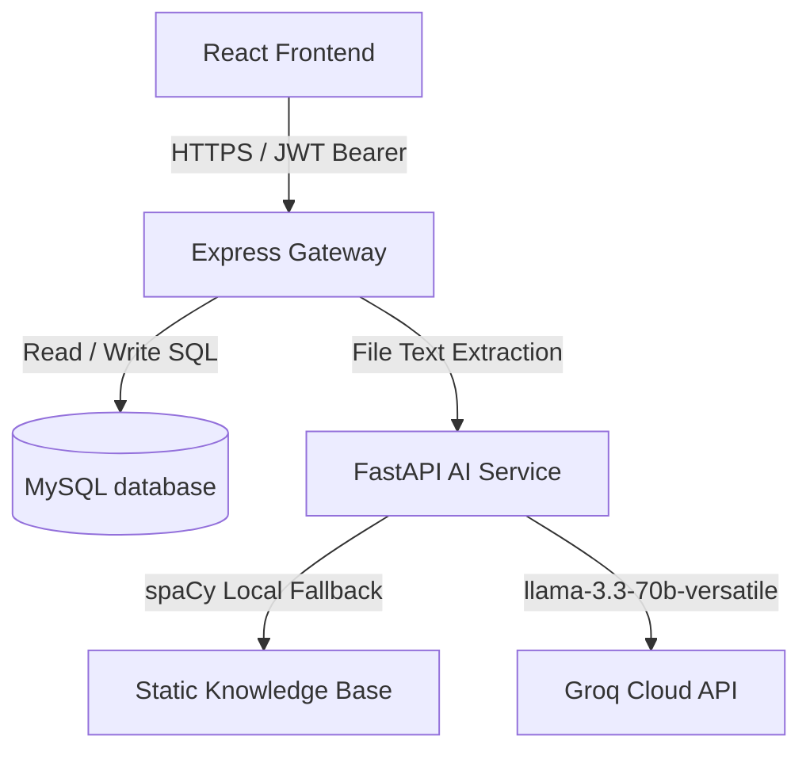
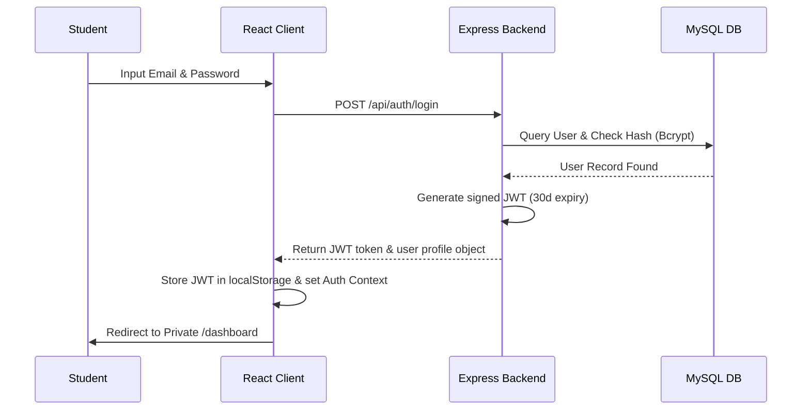

# SkillLens Pro 🎯

[](LICENSE)
[](https://nodejs.org)
[](https://python.org)
[](https://fastapi.tiangolo.com)
[](https://react.dev)

SkillLens Pro is a comprehensive, full-stack AI career platform designed to analyze resumes, detect skill gaps against specific job roles, provide tailored learning recommendations, and test knowledge through an interactive mock interview simulator.

Built with a high-performance **Vite-React frontend**, an **Express/Node.js backend API gateway**, a robust **Python FastAPI microservice** for spaCy NLP parsing, and **MySQL** for persistence, it provides recruiters, open-source contributors, and students with an industry-grade dashboard experience.

---

## ✨ Features & Capabilities

* **📄 Intelligent Resume Parsing:** Upload PDF or DOCX resumes. The Python microservice extracts skills via spaCy NLP, analyzes length/formatting, and evaluates overall resume quality.
* **🎯 Dynamic Skill Gap Visualizer:** Target specific job roles. View exactly which required skills match your experience and which are missing, displayed in gorgeous charts powered by **Chart.js**.
* **📚 Curated Roadmaps & Courses:** Generate dynamic 5-step learning paths for custom job roles. The system scrapes real-time learning links from YouTube and Roadmap.sh.
* **🎙️ Mock & Voice Interview Simulators:** Take multiple-choice quizzes on matched skills (supported by extensive MySQL seeds) or participate in an interactive open-ended voice interview assessed by AI.
* **👑 Secure Admin Metrics Panel:** Access global platform metrics (user counts, resumes parsed, quiz statistics) and dynamically inject custom roles or new quizzes.

---

## 🖼️ Application Screenshots (Placeholders)

Below are the layout representations of the core pages within SkillLens Pro:

### 📊 Dashboard & Skill Gap Charts
```text
┌────────────────────────────────────────────────────────────────────────┐
│  SkillLens Pro  [Dashboard]  [Career Discovery]  [Quizzes]  [Profile]  │
├────────────────────────────────────────────────────────────────────────┤
│  Welcome back, Student!                                                │
│                                                                        │
│  [ Upload Resume (PDF/DOCX) ]      Target Role: Frontend Developer     │
│  ┌──────────────────────────┐      ┌────────────────────────────────┐  │
│  │    Resume parsed: 85%    │      │        Skill Match Score       │  │
│  │   - 12 skills extracted  │      │   [▓▓▓▓▓▓▓▓▓▓▓▓▓▓▓░░░] 75%     │  │
│  └──────────────────────────┘      └────────────────────────────────┘  │
│                                                                        │
│  Extracted Skills:                 Detected Gaps:                      │
│  [React] [JavaScript] [HTML]       [TypeScript] [Next.js] [Jest]       │
└────────────────────────────────────────────────────────────────────────┘
```
*(Placeholder for actual application interface screenshots - see `/frontend/public/` for assets).*

---

## 🛠️ Unified Technology Stack

| Layer | Technologies & Frameworks | Description |
| :--- | :--- | :--- |
| **Frontend** | React.js (v18), Vite, React Router, Chart.js, Axios, Vanilla CSS | Fast client-side rendering with rich custom animations and responsive layouts. |
| **Backend Gateway** | Node.js, Express.js, JWT, Multer, `mysql2/promise` | Core REST API handling auth, role guards, file system uploads, and caching. |
| **AI Microservice** | Python (v3.9+), FastAPI, spaCy, PyPDF2, python-docx, Groq API | NLP text parsing, automated ATS scoring, and llama-3.3 mock evaluations. |
| **Database** | MySQL Server (v8.0+) | Persists credentials, resume indexes, quizzes, and results. |

---

## 🏛️ Platform Architecture & Topology

SkillLens Pro relies on a decoupled microservices design optimized for speed, reliability, and offline-mode resilience:



### 🔐 Authentication Flow



For a deep architectural review, see the [SYSTEM_DESIGN.md](file:///d:/SkillLens/SYSTEM_DESIGN.md) and [ARCHITECTURE.md](file:///d:/SkillLens/ARCHITECTURE.md) guides.

---

## 📂 Quick Folder Structure Map

```text
SkillLens-Pro/
├── ai-service/              # Python FastAPI AI microservice (port 8011)
│   ├── app/                 # Core parser & LLM services
│   ├── main.py              # Microservice server router
│   └── requirements.txt     # Python NLP packages
├── backend/                 # Node.js Express REST API server (port 5000)
│   ├── src/                 # Controllers, Middlewares, Routes, Configs
│   ├── package.json         # Backend Node dependencies
│   └── seed_*.js            # Relational database seeds
├── frontend/                # Vite React client SPA (port 5173)
│   ├── src/                 # Contexts, Services, Components, Pages
│   └── package.json         # Frontend Node dependencies
├── start-all.bat            # Automated local startup launcher
└── README.md                # Platform index documentation
```

---

## 🚀 Local Running & Installation

Getting started with SkillLens Pro is easy. Follow this quick setup to launch the application:

### Prerequisites
- **Node.js** (v18 or higher)
- **Python** (v3.9 or higher)
- **MySQL Server** (Running locally on default port `3306`)

### 1. Database Setup
Make sure you have a MySQL server instance running on local port `3306`.
```bash
cd backend
npm install
node src/config/setupDB.js
```
*(This script automatically creates `skilllens_db` and seeds standard job roles and interview questions).*

### 2. Configure Environment Files
1. In `backend/.env`, set your database credentials:
   ```env
   PORT=5000
   DB_HOST=localhost
   DB_USER=root
   DB_PASSWORD=your_mysql_password_here
   DB_NAME=skilllens_db
   JWT_SECRET=super_secret_key_123
   AI_SERVICE_URL=http://localhost:8011
   ```
2. In `ai-service/.env`, add a Groq API key to enable live LLM chat and grading:
   ```env
   GROQ_API_KEY=your_groq_api_key_here
   ```

### 3. Run the Application Locally
* **Windows Users:**
  Simply double-click the `start-all.bat` script in the root directory or execute:
  ```cmd
  start-all.bat
  ```
* **macOS / Linux Users:**
  Open three terminal windows and start the services individually:
  ```bash
  # 1. Start Python FastAPI
  cd ai-service && source venv/bin/activate && uvicorn main:app --port 8011 --reload

  # 2. Start Express Backend
  cd backend && npm run dev

  # 3. Start React Frontend
  cd frontend && npm run dev
  ```

Once started, open **[http://localhost:5173](http://localhost:5173)** in your browser!

---

## 🚀 Deployment Instructions

### 1. Deploying Backend & AI Services (e.g., Render / AWS)
* **AI Service (FastAPI):**
  - Host environment: Python 3.10+.
  - Build command: `pip install -r requirements.txt`.
  - Start command: `uvicorn main:app --host 0.0.0.0 --port $PORT`.
  - Environment variables: Set `GROQ_API_KEY`.
* **Express Backend:**
  - Build command: `npm install`.
  - Start command: `node src/index.js`.
  - Set production environment variables (e.g. `DB_HOST`, `DB_PASSWORD`, `JWT_SECRET`, and `AI_SERVICE_URL` pointing to the deployed FastAPI instance).

### 2. Deploying Frontend (e.g., Vercel / Netlify)
* Build command: `npm run build`.
* Output Directory: `dist`.
* Configure production environment variables:
  - `VITE_API_URL` pointing to your deployed Express backend.
  - `VITE_AI_SERVICE_URL` pointing to your FastAPI service.

---

## 🔮 Future Scope & Roadmap

- **🎙️ Real-time Audio Streaming:** Upgrade the voice interview simulator to stream raw WebRTC audio instead of plain text transcripts.
- **📄 Advanced NLP Parsing:** Train custom SpaCy NER (Named Entity Recognition) models specifically on technology terminology to extract modern tech keywords.
- **🔗 ATS Integration APIs:** Support standard HR-platform hooks (e.g., Workday, Greenhouse) to auto-submit scored resumes.
- **📈 Learning Progress Analytics:** Build a student curriculum dashboard tracking course completions and quiz progress over time.

---

## 🛠️ Troubleshooting & Support

* **Q: The database connection fails with `ER_ACCESS_DENIED_ERROR`?**
  * Ensure your database username and password in `backend/.env` match your MySQL credentials.
* **Q: spaCy fails to load the model on first launch?**
  * The service attempts to download `en_core_web_sm` automatically. If blocked by network permissions, manually download it by executing `python -m spacy download en_core_web_sm` in your activated virtual environment.
* **Q: Uploading a resume returns a 502 Gateway Error?**
  * This happens when the backend cannot reach the FastAPI microservice. Verify that the FastAPI service is running on port `8011` and check `AI_SERVICE_URL` in `backend/.env`.

---

## ❓ FAQ (Frequently Asked Questions)

### Q: Do I need a paid Groq key to run this locally?
**A:** No. If `GROQ_API_KEY` is omitted, the system seamlessly activates its **Offline Mode**, utilizing a comprehensive local spaCy matching database (`static_kb.py`) for all career roadmaps, interview questions, and scoring.

### Q: Can I run this with PostgreSQL instead of MySQL?
**A:** The database layer uses raw SQL queries tailored to MySQL. Adapting the system to PostgreSQL requires swapping the `mysql2` driver for `pg` and minor syntax changes to JSON and auto-increment columns.

### Q: How do I access the Admin panel?
**A:** Register a standard account on the frontend, then connect to your MySQL terminal and run:
`UPDATE users SET role = 'admin' WHERE email = 'your_registered_email@example.com';`

---

## 🤝 Contribution & License
- We welcome open-source contributions. Please read the [CONTRIBUTING.md](file:///d:/SkillLens/CONTRIBUTING.md) and [SECURITY.md](file:///d:/SkillLens/SECURITY.md) guidelines first.
- Distributed under the MIT License. See `LICENSE` for details.

---

## 🏆 Credits & Mentions

- **Lead Architect:** [Manohar Kunda](https://github.com/manohar-kunda)
- **Natural Language Parsing:** Powered by the incredible [spaCy NLP Foundation](https://spacy.io/).
- **AI Mentorship Engine:** Enabled via [Groq Cloud Platform APIs](https://groq.com/).
- **Onboarding Blueprints:** Standardized under CNCF documentation guidelines.
