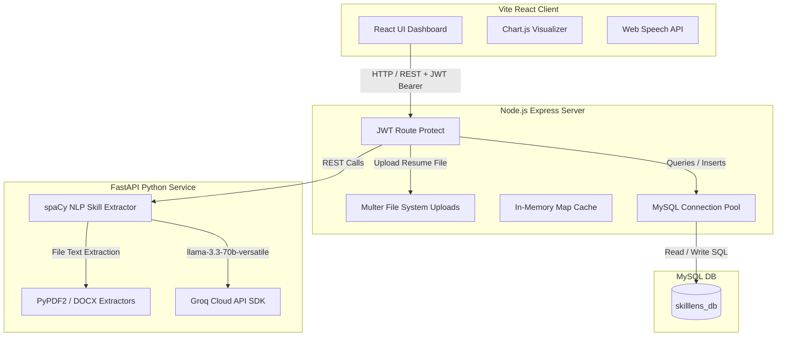
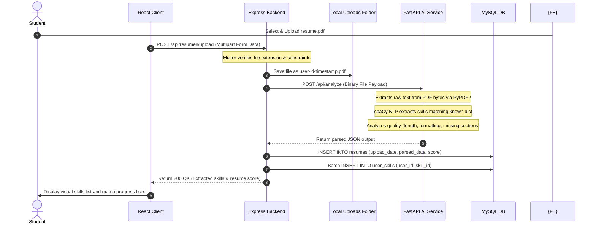
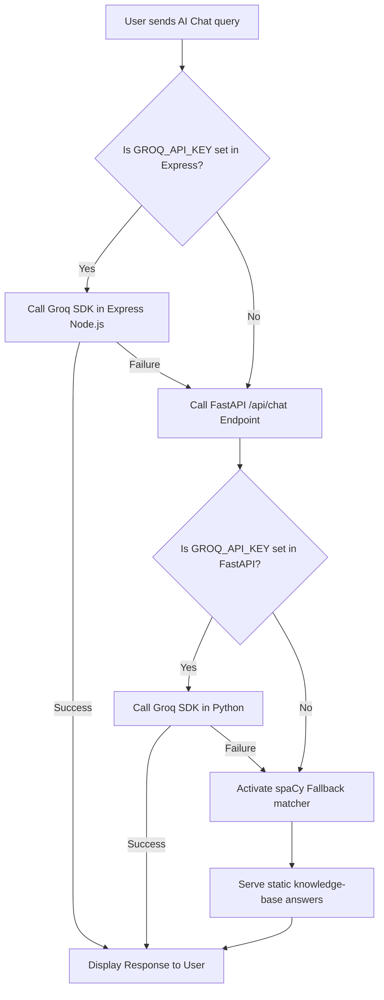

# 🏛️ System Design & Platform Topology - SkillLens Pro

This document describes the high-level system design, data flows, communication protocols, request lifecycles, and architectural strategies of **SkillLens Pro**, a microservice-powered AI platform.

---

## 🗺️ High-Level System Architecture

SkillLens Pro relies on a decoupled, multi-tiered microservices design to ensure high-performance UI rendering, secure database persistence, and resilient NLP resume parsing:



---

## 🔄 Request Lifecycle Tracing

### 📝 Scenario: Uploading & Analyzing a Resume
This flow trace tracks how a file (PDF/DOCX) moves from the UI component to database persistence and NLP matching:



---

## 🧠 Multi-Tier AI Communication Protocol

SkillLens Pro implements a high-availability AI communication pattern designed to provide fast, reliable responses even when upstream API quotas are exhausted or offline.



1. **Tier 1: Direct Groq Integration (Express Backend):** 
   If `GROQ_API_KEY` is present in the Express environment variables, the backend calls Groq's SDK directly using the highly responsive `llama-3.3-70b-versatile` model.
2. **Tier 2: Python Microservice Bridge:** 
   If the direct Groq call fails or the key is absent in the backend, Express delegates the request to the FastAPI AI microservice `/api/chat` endpoint.
3. **Tier 3: Offline spaCy & Knowledge Base Fallback:** 
   If all API keys are missing, the FastAPI service activates its local NLP engine. It tokenizes the input message, matches keywords against a dictionary in `static_kb.py`, and extracts appropriate answers or static professional recommendations.

---

## 💾 Database Flow & Persistence Layer

All relational data flows occur through a connection pool managed by Express utilizing the `mysql2/promise` library:
- **Connection Reuse:** A configured pool of up to 10 connections avoids the latency of spawning a new socket handshake for every query.
- **Relational Integrity:** Foreign key constraints are set to `ON DELETE CASCADE`. When a user account or custom job role is deleted, all dependent tables (such as `skill_gaps`, `user_results`, and `user_skills`) automatically clear themselves, preventing orphaned database records.

---

## ⚛️ Frontend State Management & Auth Flow

- **Session Context:** The application tracks authenticated states globally using React's **Context API** (`AuthContext.jsx`). This prevents prop-drilling by sharing active user data and role tokens horizontally across all UI layers.
- **Local Storage Syncing:** The `user` object and signed JWT token are persisted in `localStorage` upon login or registration. On application boot, the context checks `localStorage` to resolve user context, preventing session loss on page refreshes.
- **Dynamic Theme Management:** The platform provides standard dark/light mode configurations via a specialized `ThemeContext.jsx`, dynamically toggling class hierarchies in the document layout.

---

## ⚠️ Robust Error Handling Strategy

SkillLens Pro enforces defensive error-handling guardrails at each level of the full-stack pipeline:

### 1. Express API Gateway level
- **Controller Try/Catch blocks:** Every router controller wraps its logic in a clean `try/catch` block, ensuring that database errors or microservice timeouts never cause the Express server thread to crash.
- **Resilient Retry Policy:** When calling the FastAPI microservice, Express wraps the Axios request in a custom `axiosWithRetry.js` helper. If a connection reset or Bad Gateway error is encountered (typical of free-hosting platform cold-starts), the gateway automatically retries the query up to **3 times** with an exponential delay (e.g. 5s, 10s, 15s).

### 2. Python FastAPI level
- **HTTP Exceptions:** Endpoint payloads are validated using **Pydantic** schemas. Incorrectly formatted requests are instantly blocked with clean `400 Bad Request` or `422 Unprocessable Entity` JSON responses, avoiding execution failures.

### 3. React Client level
- **Axios Interceptors:** Network failures or expired JWT tokens are intercepted gracefully, prompting user redirection to the login page or displaying a localized notification instead of breaking the browser window context.

---

## 📝 Logging & Monitoring Strategy

- **Express Traffic logs:** Express integrates the **Morgan** logging library (`app.use(morgan('dev'))`). Every incoming HTTP query records the method, route target, response status code, execution time, and payload size directly to `stdout`.
- **FastAPI logs:** The Python service outputs uvicorn execution logs. Whenever spaCy processes a resume, the exact file parsing time, word counts, and parsing method (LLM vs spaCy local fallback) are logged to the stdout stream.
- **Production Observability:** In production, stdout stream outputs are routed directly to centralized logs collectors (such as AWS CloudWatch or Render Log Streams) to track server performance.

---

## 🌐 Deployment Architecture

SkillLens Pro is architected for seamless hosting on modern SaaS environments:

```text
┌────────────────────────────────────────────────────────┐
│                   Vercel / Netlify                     │
│               [ React Client (SPA) ]                   │
└──────────────────────────┬─────────────────────────────┘
                           │
                           │ HTTPS (REST API queries)
                           ▼
┌────────────────────────────────────────────────────────┐
│                        Render                          │
│               [ Express API Gateway ]                  │
└──────────────────────────┬─────────────────────────────┘
                           ├─────────────────────────────┐
                           │ (Local TCP/IP on 8011)      │ (SQL pool)
                           ▼                             ▼
┌────────────────────────────────────────────────────────┐ ┌────────────────────────────────────┐
│                        Render                          │ │              AWS RDS               │
│             [ FastAPI AI Microservice ]                │ │          [ MySQL Engine ]          │
└────────────────────────────────────────────────────────┘ └────────────────────────────────────┘
```

- **Frontend:** Hosted as a static, optimized Single Page Application (SPA) on Vercel or Netlify.
- **API Gateway & Microservice:** Deployed as separate web services on Render. The Express API Gateway exposes routes to the public, while the FastAPI service is sandboxed to only accept requests originating from the backend gateway's IP.
- **Persistent Database:** Hosted on a managed SQL cloud system (such as AWS RDS or Aiven MySQL) to guarantee data backups, high availability, and transaction reliability.
